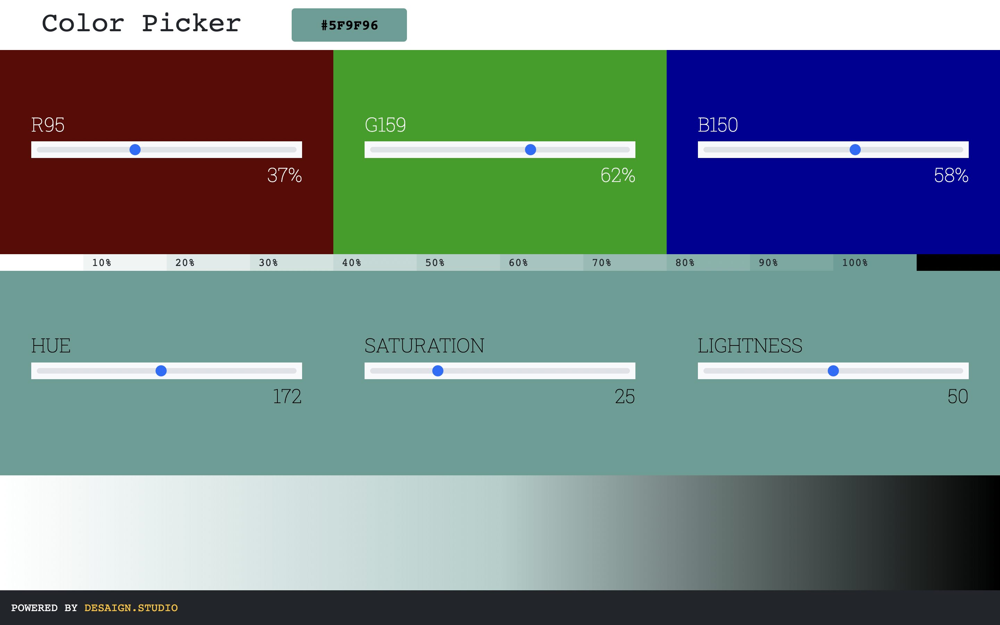

## Color Picker by Desaign Studio

Descriptions

### Version

✔ Last Update @done (6/5/2022, 2:12:05 PM)

### Framework
 
- HTML5, CSS3, JavaScript, SCSS

### Built With

- jQuery, Bootstrap, Google Fonts, SVG

### Software

- Visual Studio Code Editor
- Github for versioning

### Credits

- https://stackoverflow.com/questions/18389224/how-to-style-html5-range-input-to-have-different-color-before-and-after-slider
- https://css-tricks.com/switch-font-color-for-different-backgrounds-with-css/

### CONTRIBUTE

- A [contributing guideline](https://github.com/kratuvwxyz/CONTRIBUTE) available.

### LICENSE

- [MIT](https://github.com/kratuvwxyz/LICENSE) © 2021 Kratu Desai, DESAIGN LLC.

### Moving Forward

- Version 2 with more data functionality and api connection

## CONTACT

Thank you for your time and consideration. My mantra is simple, *chase perfection to catch excellence*. I hope you enjoy my work. **I'd love to hear from you.** Please email me at <a href="mailto:github@desaign.studio?Subject=Message from Github">github@desaign.studio</a>.

 &copy; 2011-2022. <a href="https://desaign.app" target="_blank" style="text-decoration:none;">DESAIGN STUDIO</a>. All Rights Reseverd. &#160;
 &#160;
 &#160;
 &#160;
 &#160;